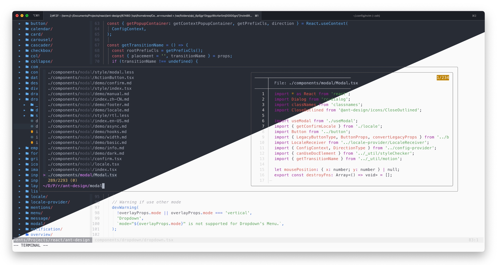
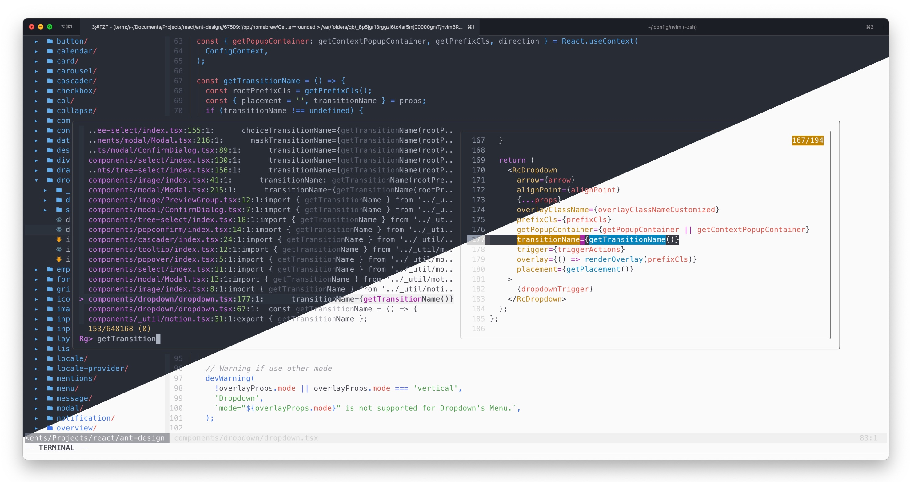

# Neovim Configuration

## Screenshot

smart complete


file fuzzy finder



global fuzzy finder



## Require

neovim version > 7.0, macOS system use 

```bash
brew install --HEAD neovim
```

to install nightly neovim or select determined pre-built version at [neovim-release](https://github.com/neovim/neovim/releases/tag/v0.7.0)

## Installation

1. install language server and command line tools

```bash
# language server
npm i -g typescript typescript-language-server diagnostic-languageserver

# prepare for eslint
brew install efm-langserver; npm i -g eslint_d

# fuzzy finder and regex finder
brew install fzf ripgrep

# suggest change default cl tool used by fzf.vim
brew install fd bat
```

2. install this repo

```bash
# install repo
cd ~/.config && git clone https://github.com/Mittsuyama/neovim-configuration.git nvim
```

3. install vim-plug

```bash
# neovim configuration dirs
mkdir -p ~/.config/nvim/autoload ~/.config/nvim/plugged

# install vim-plug
curl -fLo ~/.config/nvim/autoload/plug.vim  https://raw.githubusercontent.com/junegunn/vim-plug/master/plug.vim
```

4. install plug

```bash
# ~/.config/nvim/plug.vim
cd ~/.config/nvim/ && nvim plug.vim
```

5. run neovim command

```vim
:PlugInstall
```

## .zshrc

some recommended .zshrc configuration

```zsh
alias ls="lsd -al --group-dirs=first --blocks=permission,date,name --date=relative"
alias cat="bat --theme=OneHalfLight"
alias fm="vim -o \`fzf\`"
alias gdiff="git diff --name-only --relative --diff-filter=d | xargs bat --theme=OneHalfLight --diff"

export FZF_DEFAULT_COMMAND="fd --exclude={.git,.idea,.vscode,.sass-cache,node_modules,build} --type f -H"
export FZF_DEFAULT_OPTS="--height 60% --ansi --preview-window 'right:50%' --preview 'bat --color=always --theme=OneHalfLight --style=header,grid,numbers --diff {}'"

export FZF_DEFAULT_OPTS=$FZF_DEFAULT_OPTS'
 --color=fg:#494b53,bg:#fafafa,hl:#a0a1a7
 --color=fg+:#494b53,bg+:#f0f0f0,hl+:#a626a4
 --color=info:#c18401,prompt:#d7005f,pointer:#a626a4
 --color=marker:#87ff00,spinner:#af5fff,header:#a626a4'
```

## Use Dark Theme

1. change `init.vim` background variable

```vim
set background=dark
```

2. change `after/plugin/indent-blankline.rc.lua` line 3:

```lua
vim.cmd [[highlight IndentBlanklineIndent1 guifg=#666666 gui=nocombine]]
```

3. change `after/plugin/lualine.rc.lua` line 7:

```lua
    theme = 'onelight',
```

4. change `after/plugin/fzf.rc.vim` line 20:

```vim
let $FZF_PREVIEW_COMMAND = "bat --color=always --theme=OneHalfLight --style=${BAT_STYLE:-numbers} --pager=nenver {}"
```

## Reference

1. [Linux 下 Neovim 配置 Python 开发环境指南](https://jdhao.github.io/2018/09/05/centos_nvim_install_use_guide/)
2. [How to set up Neovim 0.5 (LSP, Treesitter, fuzzy finder, etc)](https://www.youtube.com/watch?v=FW2X1CXrU1w)
